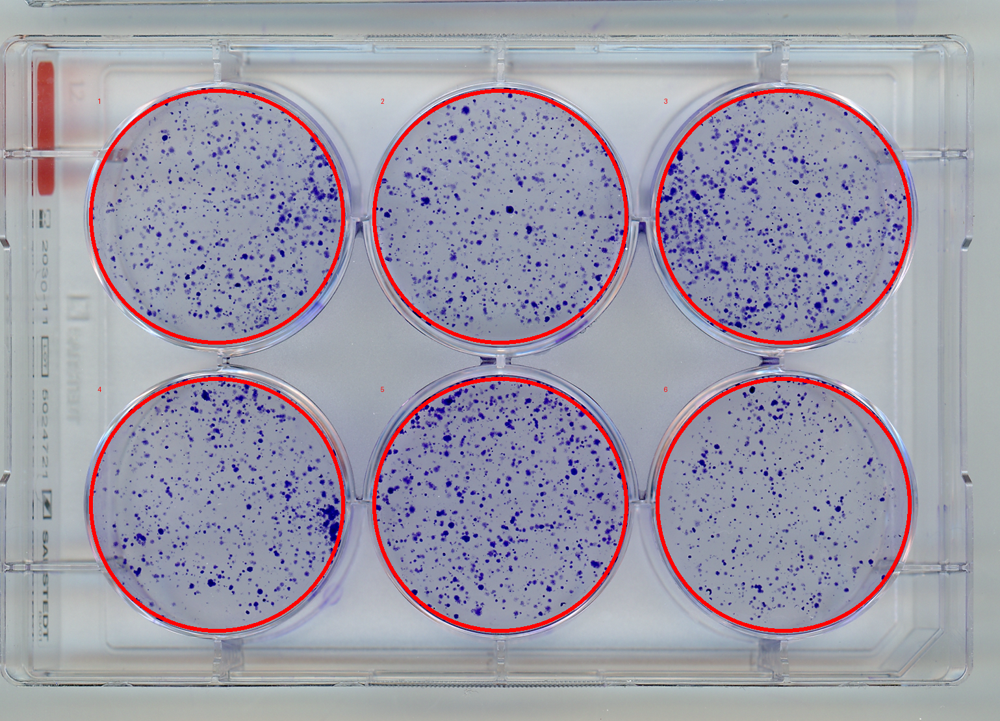
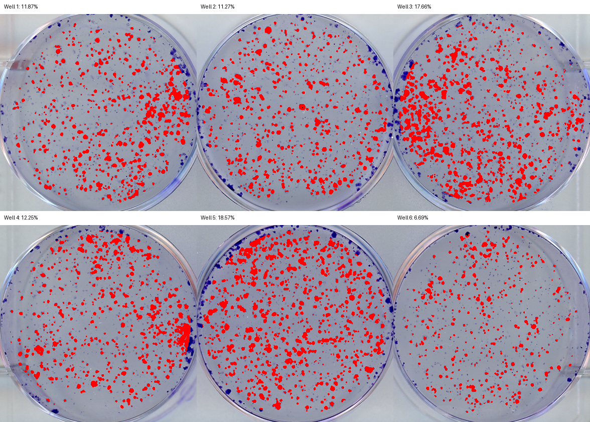
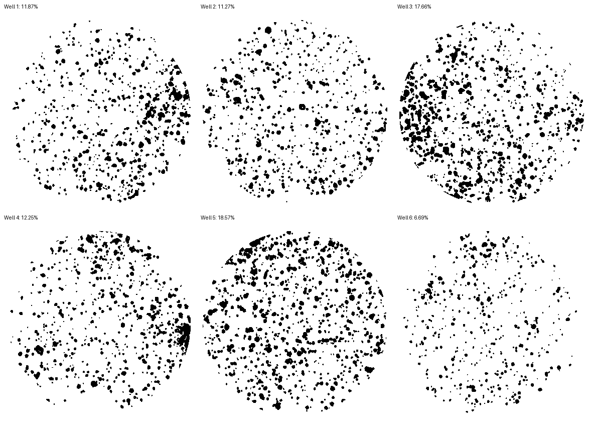

# CFA Colony Area Quantification

Python image analysis for colony formation assays (CFA). Processes TIFF, PNG and JPEG images of stained 6-well plates and reports the percentage of each well covered by colony stain.

The pipeline crops to the lower stained plate area, straightens the image, locates the six wells and segments the stained area. Each run produces CSV measurements, masks and overlays for visual QC.

For a step-by-step walkthrough, see [TUTORIAL.md](TUTORIAL.md).

## Author

- [Angelina Yershova](https://github.com/itismeangie) · [LinkedIn](https://www.linkedin.com/in/angelina-yershova/)

## Output Files

For each run, the output directory contains:

- `colony_area_well_results.csv`: one row per well.
- `colony_area_image_summary.csv`: one row per image.
- `colony_area_sample_summary.csv`: grouped summary by relative sample folder.
- `qc_flags.csv`: geometry, grid-confidence, and extreme-area warnings.
- `failed_images.csv`: images that could not be processed.
- `duplicate_images.csv`: exact duplicate files skipped by the default de-duplication step.
- `internal_control_qc.html`: open this first for visual QC.
- `sample_mask_qc/`: per-sample mask, overlay, and grid audit pages.
- `grid_qc_contact_sheet.png`: red well circles over every image.
- `overlay_contact_sheet.png`: red colony-mask overlay for every well.
- `mask_contact_sheet.png`: binary colony masks for every well.
- `deskew_contact_sheet.png`: deskewed image previews.
- `per_image/`: detailed per-image crops, masks, overlays, and text outputs.

Open `internal_control_qc.html` to check well detection and colony masks against the original images. For individual samples, use `sample_mask_qc/index.html`.

## Example Visual QC Outputs

Example panels from the HTML QC report:

**Plate/well detection:** red circles should sit on the well rims.



**Colony mask overlay:** red pixels are counted as colony area.



**Binary masks:** black pixels are counted, white pixels are excluded.



## Installation

Use **Python 3.10 or newer**. Clone the repository, then install dependencies:

```bash
git clone https://github.com/ewing-sarcoma-fightclub/analyse-CFA-automatically.git
cd analyse-CFA-automatically
python3 -m venv .venv
source .venv/bin/activate
python -m pip install --upgrade pip
python -m pip install -r requirements.txt
```

Alternatively, install the project in editable mode:

```bash
python -m pip install -e .
```

## Usage

Run the script on a directory containing `.tif`, `.tiff`, `.png`, `.jpg`, or `.jpeg` files:

```bash
python calculate_colony_area.py /path/to/image_folder
```

By default, results are written to:

```text
/path/to/image_folder/_colonyarea_results
```

To choose a separate output folder:

```bash
python calculate_colony_area.py /path/to/image_folder -o /path/to/output_folder
```

If installed with `pip install -e .`, the command-line entry point is:

```bash
cfa-colony-area /path/to/image_folder -o /path/to/output_folder
```

To write CSVs and per-image text results without visual contact sheets:

```bash
python calculate_colony_area.py /path/to/image_folder --no-artifacts
```

The default mode is recommended because it produces `internal_control_qc.html` with visual masks and overlays.

Exact duplicate image files are skipped by default so copied files are not counted as independent images. To intentionally process duplicate files as separate records:

```bash
python calculate_colony_area.py /path/to/image_folder --keep-duplicates
```

## Input Organization

The input directory is scanned recursively for `.tif`, `.tiff`, `.png`, `.jpg`, and `.jpeg` files. The relative parent folder path is used as the sample label. For one-level folders this is just the folder name; for nested folders this keeps the experiment context.

Example:

```text
input/
  experiment_1/
    M ctrl/
      img057.tif
      img058.jpg
  experiment_2/
    M2/
      img074.png
      img075.tif
```

The output summary will use `experiment_1/M ctrl` and `experiment_2/M2` as sample names.

## Method Summary

1. Detect stained pixels in the lower portion of the image to localize the plate region.
2. Estimate and correct image horizon using low-saturation plastic plate edges.
3. Detect six well positions using circular rim/plate-edge responses.
4. Fall back to stain-based well detection if rim detection is not confident.
5. Crop each well, threshold blue/purple colony stain across a broad well-interior ROI, remove elongated rim artifacts while preserving compact edge colonies, and calculate colony area as:

```text
100 * colony_mask_pixels / well_roi_pixels
```

6. Write CSVs and visual QC artifacts.

## Quality Control

Always inspect `internal_control_qc.html` after a run.

Check:

- Red well circles are centered on the stained wells.
- Red mask overlays cover central and edge colonies without including large background or long rim streaks.
- Binary masks match the visible stained colony area.
- `sample_mask_qc/index.html` for per-sample mask and overlay contact sheets.
- `qc_flags.csv` for low grid confidence, fallback grid detection, or near-saturated wells.

## Data Files

Raw TIFF/JPEG/PNG/PDF/XLSX/ZIP files and generated output folders are ignored by `.gitignore`. Keep large raw image data outside the code repository or use Git LFS if raw data must be versioned.

## Tests

Tests cover segmentation edge cases, duplicate-image handling, output-folder exclusion and QC-report generation:

```bash
python -m unittest discover -s tests -v
```

Check that the scripts compile:

```bash
python -m py_compile analyze_cfa_plate_one.py batch_cfa_colony_area.py calculate_colony_area.py
```

## Image Requirements

- Use blue/purple stained 6-well plate images with the target plate in the lower half of the image.
- Keep all six well rims visible and avoid glare or tight cropping.
- For other stains or imaging conditions, adjust the segmentation thresholds and check the resulting masks against the images.

## Related Work

- [Single-cell RNA-seq QC, annotation and integration](https://github.com/ewing-sarcoma-fightclub/scRNAseq_qc_annotation)
- [SF3B4 and chromosome 1q gain analysis](https://github.com/itismeangie/SF3B4-as-1q-gain-driver)

## License

MIT License. See [LICENSE](LICENSE).
